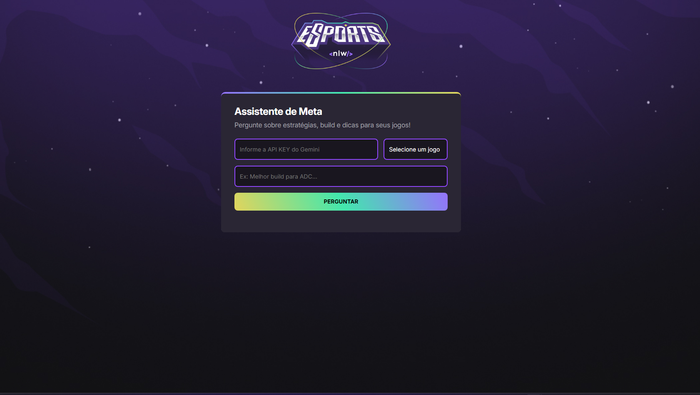

# 📊 NLW Agents |  Assistente de Meta | NLW#20

Este projeto é um assistente de meta de um projeto passado onde incorporamos a IA para fazer a pesquisa da solicitação do usuario é um projeto clássico do NLW eSports com uma pegada totalmente nova e inteligente: você vai criar um Assistente de IA para Gamers. Imagine um aplicativo com design moderno e animações, que te auxilia nos jogos e dá dicas de estratégia em tempo real, tudo isso usando a API do Gemini como o cérebro do nosso assistente.

## 🚀 Tecnologias Utilizadas
 
   
 

---

## 🔗 Deploy 

## Anotações durante o Evento

# HTML
- HypertText
    - Textos puros, livros, revistas, jornais;
    - Links: acessar outros documentos;
    - Imagens, vídeos, áudios;
- Markup
    - Marcação
    - Tags: <a> Link </a>
    - Atributos: <a href="https://rocketseat.com.br">
    - Globais: id, class, ...
- Language
    - Linguagem
    - Sintaxe: maneira de escrever

# HTTP
- HyperText
- Transfer
    - Transferência
- Protocol
    - Protocolo
    - Conjunto de regras
- Methods HTTP (verbos): Get, Post, Patch/Put, Delete
- Headers (cabeçalhos): Instruções/Informações extras para cada chamada

# URL
- Uniform
    - Uniforme
- Resource
    - Recurso
- Locator
    - Localizador
Encontrar um recurso (html, css, js, pdf, jpg, mp4, mpr, ...)
Endereço

# IP
- Internet
  - Rede mundial de computadores
- Protocol
  - Conjunto de regras
Endereço do computador
rocketseat.com.br (domínio)
123.32.1.23 (ip)

# DNS
- Domain
  - Domínio
- Name
  - Nome
- Server
  - Servidor

# CSS

- Cascading
  - Cascata
  - Regras das escritas
  - Hierarquia
  - Especificidade
- Style
  - Estilo
- Sheet
  - Folha

De um arquivo que terá na sua sintaxe, declarações, propriedades e valores.
A partir disso, o HTML é impactado visualmente.

- declaração
- seletor
- propriedade e valor

# JS
- Linguagem de programação
- Browsers
- Input -> Process -> Output
- Variáveis
- Function
  - Agrupamento e reuso de código
  - Sequencia lógica
  - Saída
- Gemini (IA): esperar uma resposta
- Mexer no meu navegador
- Estrutura de dados
- Estrutura de decisão
- Algoritmo: sequencia de passos lógica, de maneira ordenada, a fim de chegar a alguma conclusão (limitada)
- Lógica (Pensamento computacional)
  - Abstração
  - Decomposição
  - Algoritmo
  - Reconhecimento de padrão
- Tipos de dados
  - Number (números)
  - String (textos) (" ",  ' ',  ` `)
  - Boolean: true | false
  - Objects
  - ...

# DOM
- Document
- Object
- Model

# API
- Application
- Programming
- Interface
- JSON: JavaScript Object Notation

# CDN
- Content
- Delivery
- Network

# LLM
- Large
- Language
- Model
- Gemini, OpenAI (chatGPT), Anthropic (Claude) ...

# Agentes AI
- Tools (ferramentas): permitem uso de código, ou apps, ou qualquer informação extra.
- Melhor contexto

# Engenharia de prompt
- One shot: uma única pergunta sem muito contexto
- Few shot: é apresentado exemplos do que se espera
- Chain of Thought: Cadeia de pensamento para a IA responder gradativamente conforme a instrução.

## 💻 Sobre mim 😄
 Entusiasta da programação e Engenheiro de Software com foco em desenvolvimento front-end rumo ao full stack. Dedicado a criar experiências digitais inovadoras que impactam o mundo através da tecnologia.

## 🔗 Contato 

## 📄 Licença

Este projeto está sob a licença MIT.

